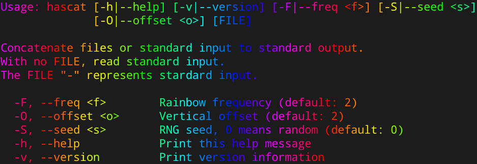

# hascat

It's `cat` but with rainbows and monads.

## Dependencies

- [A terminal emulator that supports truecolor](https://gist.github.com/XVilka/8346728#now-supporting-truecolour)
- [ghc](https://www.haskell.org/downloads/linux) (build)
- [System.Random](https://hackage.haskell.org/package/random) (build)
- [Options.Applicative](https://hackage.haskell.org/package/optparse-applicative) (build)
- [Data.Semigroup](https://hackage.haskell.org/package/semigroups) (build)

## Installation

- clone this repository
- `make`
- copy `hascat` to somewhere in your $PATH

## Usage

## Todo

- Support non-truecolor terminals
- Support inverting the color
- Support different rainbow directions
